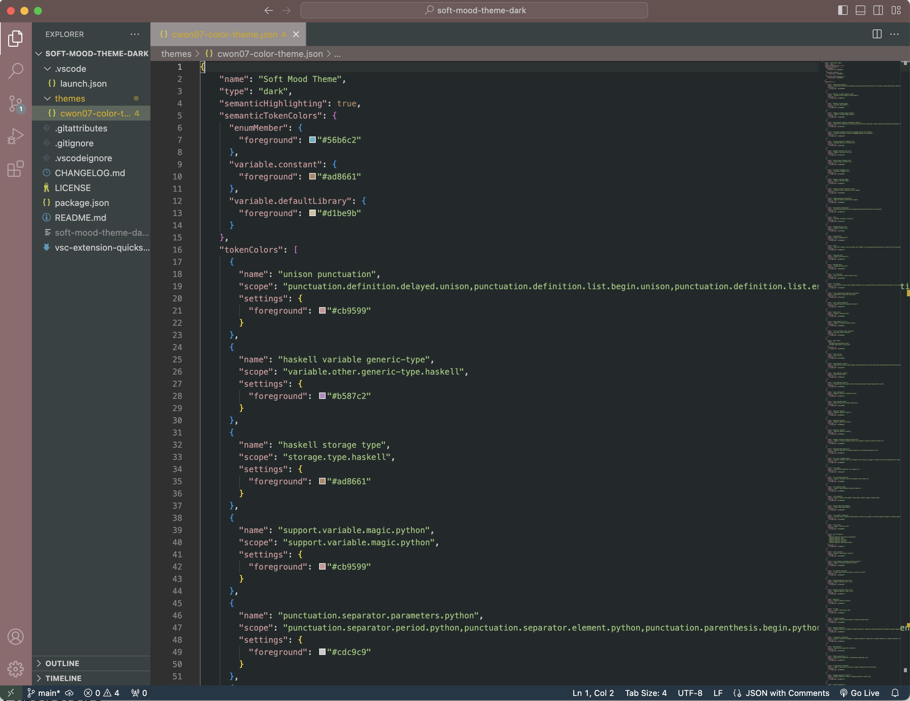
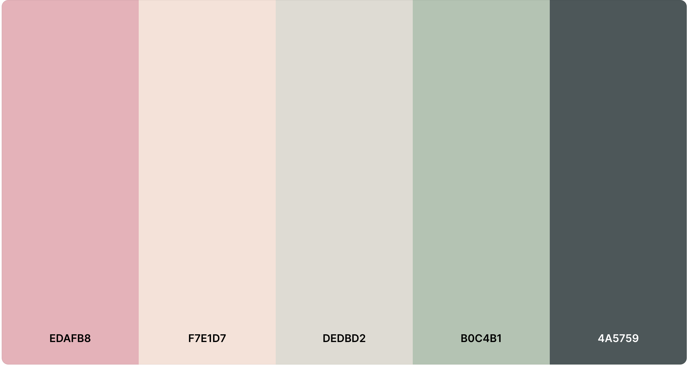

# Soft Mood VS Code Theme (Dark)

Soft Mood VS Code theme is designed with tranquil pastel colors that are easy on the eyes and bring a sense of warmth to your coding environment. This theme is made to enhance your workspace by blending soothing hues with a gentle, inviting ambiance. Perfect for long coding sessions, it aims to make your development experience more comfortable and visually pleasing.

## How to Install

1. Install [Visual Studio Code](https://code.visualstudio.com/download)
2. Launch Visual Studio Code
3. Choose Extensions from menu
4. Search for Soft Mood VS Code Theme
5. Click Install to install the theme
6. Click Reload to reload Visual Studio Code
7. From the menu bar, click: Code > Preferences > Color Theme > Soft Mood

## Color Theme 
Loosely adapted from [this Coolors palette](https://coolors.co/palette/edafb8-f7e1d7-dedbd2-b0c4b1-4a5759)

**Enjoy!**
